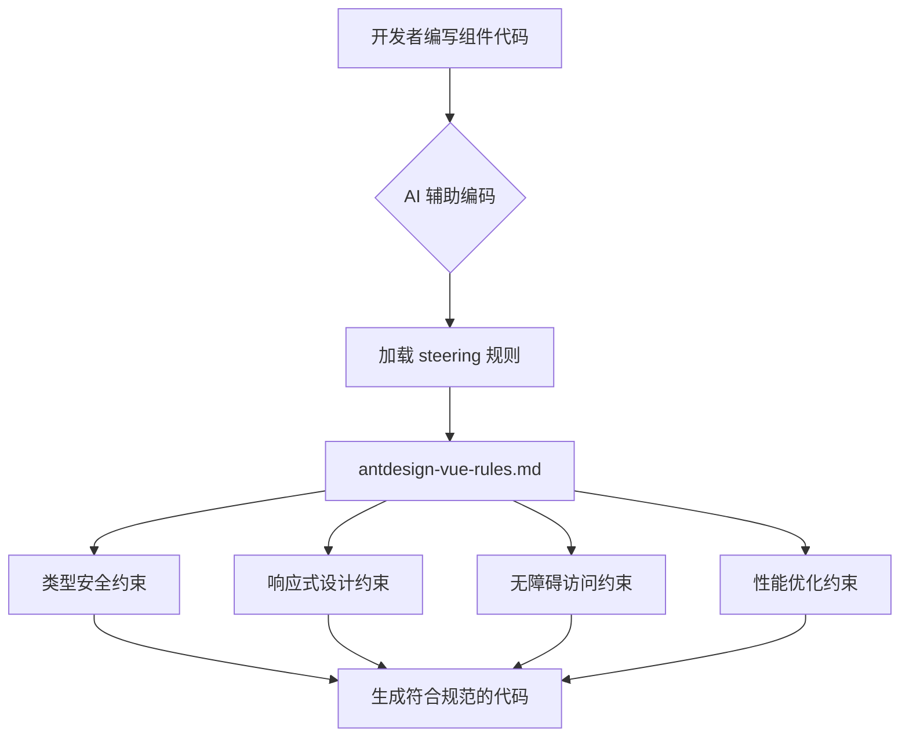
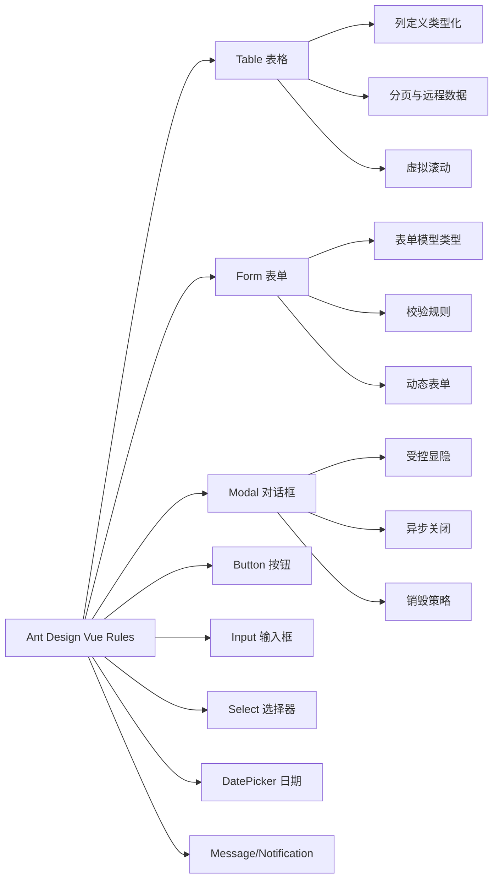

# 设计文档：Ant Design Vue 组件使用规则

## 概述

本文档定义了项目中 ant-design-vue 4.x 组件的统一使用规范。规则覆盖 Table、Form、Modal、Button、Input、Select、DatePicker、Message/Notification 等常用组件，从类型安全、响应式设计、无障碍访问、性能优化四个维度建立约束，确保团队在使用 UI 组件时保持一致性和高质量。

最终产出物为 `.kiro/steering/antdesign-vue-rules.md` 文件，作为 AI 辅助编码时的自动引导规则。规则文件遵循现有 `.cursor/rules/` 目录下的格式风格（frontmatter + 分节规则 + 示例），但适配 Kiro steering 文件的结构。

## 架构

规则文件作为 steering 指引，在 AI 辅助编码时自动加载，约束组件使用行为。



## 组件与接口

### 规则分类体系



### 核心类型定义

```typescript
// Table 列定义 - 强类型约束
import type { ColumnType } from 'ant-design-vue/es/table'

interface TypedColumn<T> extends ColumnType<T> {
  dataIndex: keyof T | string[]
  key: string
}

// Form 模型与规则 - 类型安全
import type { Rule } from 'ant-design-vue/es/form'

interface FormState {
  [key: string]: unknown
}

type TypedRules<T extends FormState> = {
  [K in keyof T]?: Rule[]
}

// Modal 配置 - 统一接口
interface ModalConfig {
  visible: boolean
  loading: boolean
  title: string
  onOk: () => Promise<void>
  onCancel: () => void
}
```

## 数据模型

### Table 数据流模型

```typescript
// 分页参数标准接口
interface PaginationParams {
  current: number
  pageSize: number
  total: number
}

// 表格请求参数
interface TableRequestParams {
  pagination: PaginationParams
  sorter?: {
    field: string
    order: 'ascend' | 'descend' | null
  }
  filters?: Record<string, (string | number)[]>
}

// 表格数据源标准结构
interface TableDataSource<T> {
  data: T[]
  total: number
  loading: boolean
}
```

### Form 数据流模型

```typescript
// 表单状态管理
interface FormInstance<T extends FormState> {
  model: T
  rules: TypedRules<T>
  loading: boolean
  validate: () => Promise<T>
  resetFields: () => void
  clearValidate: (fields?: (keyof T)[]) => void
}
```

## 算法伪代码

### Table 远程数据加载流程

```typescript
/**
 * 表格远程数据加载标准流程
 *
 * 前置条件：
 * - api 函数已定义且返回 Promise<ApiResult<PageData<T>>>
 * - pagination 为有效的分页参数
 *
 * 后置条件：
 * - dataSource 包含当前页数据
 * - pagination.total 已更新
 * - loading 状态正确切换
 */
async function fetchTableData<T>(
  api: (params: TableRequestParams) => Promise<PageData<T>>,
  params: TableRequestParams,
): Promise<TableDataSource<T>> {
  // 1. 设置 loading 状态
  const loading = ref(true)

  try {
    // 2. 调用接口获取数据
    const result = await api(params)

    // 3. 更新数据源和分页
    return {
      data: result.records,
      total: result.total,
      loading: false,
    }
  } catch (error) {
    // 4. 错误处理遵循 http-error-handling 规范
    throw error
  } finally {
    loading.value = false
  }
}
```

### Form 提交标准流程

```typescript
/**
 * 表单提交标准流程
 *
 * 前置条件：
 * - formRef 已绑定到 a-form 组件
 * - model 数据已通过 reactive/ref 声明
 *
 * 后置条件：
 * - 校验通过后执行提交
 * - 提交期间 loading 为 true
 * - 成功后重置表单或关闭弹窗
 * - 失败后保留表单数据，展示错误信息
 */
async function handleFormSubmit<T extends FormState>(
  formRef: FormInstance<T>,
  submitFn: (values: T) => Promise<void>,
): Promise<void> {
  // 1. 表单校验
  const values = await formRef.validate()

  // 2. 设置提交状态
  formRef.loading = true

  try {
    // 3. 执行提交
    await submitFn(values)

    // 4. 成功后重置
    formRef.resetFields()
  } finally {
    formRef.loading = false
  }
}
```

### Modal 生命周期管理

```typescript
/**
 * Modal 受控管理标准模式
 *
 * 前置条件：
 * - visible 通过 v-model:open 绑定
 * - 内部表单（如有）独立管理状态
 *
 * 后置条件：
 * - 关闭时清理内部状态
 * - 异步操作期间禁止关闭
 * - destroyOnClose 用于重型内容
 *
 * 循环不变量：
 * - confirmLoading 为 true 时，用户无法关闭 Modal
 */
function useModal() {
  const open = ref(false)
  const confirmLoading = ref(false)

  const show = () => {
    open.value = true
  }

  const handleOk = async (asyncFn: () => Promise<void>) => {
    confirmLoading.value = true
    try {
      await asyncFn()
      open.value = false
    } finally {
      confirmLoading.value = false
    }
  }

  const handleCancel = () => {
    if (!confirmLoading.value) {
      open.value = false
    }
  }

  return { open, confirmLoading, show, handleOk, handleCancel }
}
```

## 关键函数与规格说明

### useTable - 表格数据管理组合式函数

```typescript
function useTable<T extends Record<string, unknown>>(
  api: (params: TableRequestParams) => Promise<PageData<T>>,
  options?: { immediate?: boolean; defaultPageSize?: number },
): {
  dataSource: Ref<T[]>
  loading: Ref<boolean>
  pagination: Ref<PaginationParams>
  handleTableChange: (pag: PaginationParams, filters: any, sorter: any) => void
  refresh: () => Promise<void>
}
```

**前置条件：**

- `api` 为有效的异步函数
- `options.defaultPageSize` 为正整数（默认 10）

**后置条件：**

- 返回的 `dataSource` 始终为数组
- `pagination.total` 与后端返回一致
- `handleTableChange` 触发后自动重新请求

### useFormModal - 表单弹窗组合式函数

```typescript
function useFormModal<T extends FormState>(
  submitFn: (values: T) => Promise<void>,
): {
  open: Ref<boolean>
  confirmLoading: Ref<boolean>
  formRef: Ref<FormInstance | null>
  show: (initialValues?: Partial<T>) => void
  handleOk: () => Promise<void>
  handleCancel: () => void
}
```

**前置条件：**

- `submitFn` 为有效的异步函数
- 调用 `show` 时可传入初始值用于编辑场景

**后置条件：**

- `handleOk` 先校验表单再提交
- 提交成功后自动关闭并重置表单
- 提交失败保留表单状态

## 示例用法

### Table 标准用法

```typescript
<script setup lang="ts">
import { useTable } from '@/composables/useTable'
import { getUserList } from '@/apis/user'
import type { UserInfo } from '@/types/user'
import type { ColumnType } from 'ant-design-vue/es/table'

// 强类型列定义
const columns: ColumnType<UserInfo>[] = [
  { title: '用户名', dataIndex: 'username', key: 'username' },
  { title: '邮箱', dataIndex: 'email', key: 'email' },
  { title: '操作', key: 'action', fixed: 'right', width: 120 },
]

const { dataSource, loading, pagination, handleTableChange } = useTable(getUserList)
</script>

<template>
  <a-table
    :columns="columns"
    :data-source="dataSource"
    :loading="loading"
    :pagination="pagination"
    row-key="id"
    @change="handleTableChange"
  >
    <template #bodyCell="{ column, record }">
      <template v-if="column.key === 'action'">
        <a-button type="link" size="small">编辑</a-button>
      </template>
    </template>
  </a-table>
</template>
```

### Form 标准用法

```typescript
<script setup lang="ts">
import { reactive, ref } from 'vue'
import type { FormInstance, Rule } from 'ant-design-vue/es/form'

interface LoginForm {
  username: string
  password: string
}

const formRef = ref<FormInstance>()
const formState = reactive<LoginForm>({
  username: '',
  password: '',
})

const rules: Record<keyof LoginForm, Rule[]> = {
  username: [{ required: true, message: '请输入用户名' }],
  password: [{ required: true, message: '请输入密码', min: 6 }],
}

const loading = ref(false)

const handleSubmit = async () => {
  const values = await formRef.value!.validateFields()
  loading.value = true
  try {
    await loginApi(values)
  } finally {
    loading.value = false
  }
}
</script>

<template>
  <a-form
    ref="formRef"
    :model="formState"
    :rules="rules"
    layout="vertical"
  >
    <a-form-item label="用户名" name="username">
      <a-input v-model:value="formState.username" placeholder="请输入用户名" />
    </a-form-item>
    <a-form-item label="密码" name="password">
      <a-input-password v-model:value="formState.password" placeholder="请输入密码" />
    </a-form-item>
    <a-form-item>
      <a-button type="primary" :loading="loading" @click="handleSubmit">
        登录
      </a-button>
    </a-form-item>
  </a-form>
</template>
```

### Modal + Form 组合用法

```typescript
<script setup lang="ts">
const { open, confirmLoading, show, handleOk, handleCancel } = useFormModal(createUser)
</script>

<template>
  <a-button type="primary" @click="show()">新建用户</a-button>

  <a-modal
    v-model:open="open"
    title="新建用户"
    :confirm-loading="confirmLoading"
    :mask-closable="false"
    destroy-on-close
    @ok="handleOk"
    @cancel="handleCancel"
  >
    <!-- 表单内容 -->
  </a-modal>
</template>
```

## 正确性属性

以下属性以通用量化形式表达，确保规则的可验证性：

1. **类型安全**：∀ Table 组件，columns 定义必须使用 `ColumnType<T>` 泛型约束，dataIndex 必须为 T 的合法键
2. **表单绑定**：∀ Form 组件，`:model` 绑定的对象必须通过 `reactive()` 声明，且 `name` 属性必须为 model 的合法键
3. **受控状态**：∀ Modal 组件，必须使用 `v-model:open` 进行受控管理，禁止使用非受控模式
4. **加载状态**：∀ 异步操作触发的 Button，必须绑定 `:loading` 属性防止重复提交
5. **无障碍**：∀ 表单控件，必须关联 label 或提供 `aria-label`；∀ Icon Button 必须提供 `aria-label`
6. **性能**：∀ 大数据量 Table（>1000行），必须启用虚拟滚动或服务端分页
7. **销毁策略**：∀ 包含重型内容的 Modal，必须设置 `destroy-on-close` 避免内存泄漏
8. **消息反馈**：∀ 用户操作结果反馈，成功用 `message.success`，失败用 `message.error`，不混用 notification

## 错误处理

### 场景 1：表单校验失败

**条件**：用户提交表单但未通过校验规则
**响应**：`validateFields()` 抛出异常，表单自动标红错误字段并显示提示文案
**恢复**：用户修正后错误自动清除，无需手动调用 `clearValidate`

### 场景 2：Modal 异步提交失败

**条件**：Modal 内表单提交接口返回错误
**响应**：保持 Modal 打开，`confirmLoading` 恢复为 false，通过 `message.error` 展示错误
**恢复**：用户可修改后重新提交

### 场景 3：Table 数据加载失败

**条件**：表格数据接口请求失败
**响应**：`loading` 恢复为 false，展示空状态或错误提示
**恢复**：提供刷新按钮，用户可手动重试

## 测试策略

### 单元测试

- 验证 `useTable` 组合式函数的分页逻辑
- 验证 `useFormModal` 的状态流转
- 验证表单校验规则的正确性

### 属性测试

**属性测试库**：vitest + @vue/test-utils

- Table：任意分页参数变化后，dataSource 长度 ≤ pageSize
- Form：任意合法输入通过校验后，model 值与输入一致
- Modal：任意操作序列后，confirmLoading 为 true 时 open 不可变为 false

### 集成测试

- 完整的 CRUD 流程：列表加载 → 新建弹窗 → 表单填写 → 提交 → 列表刷新
- 错误场景：网络异常时的降级展示

## 性能考虑

- Table 大数据量场景使用 `virtual` 属性启用虚拟滚动
- Select 远程搜索使用 `debounce` 防抖（推荐 300ms）
- Modal 重型内容使用 `destroy-on-close` 释放 DOM
- Form 动态表单项使用 `v-if` 而非 `v-show` 避免无效校验
- DatePicker 面板渲染使用 `getPopupContainer` 挂载到最近滚动容器

## 安全考虑

- Input 组件禁止直接渲染用户输入为 HTML（防 XSS）
- Form 提交前必须经过前端校验 + 后端校验双重保障
- 敏感信息输入使用 `a-input-password`，禁止明文展示

## 依赖

- `ant-design-vue` ^4.2.6（已安装）
- `@ant-design/icons-vue`（图标按需引入）
- `dayjs`（DatePicker 日期处理，ant-design-vue 4.x 内置）
